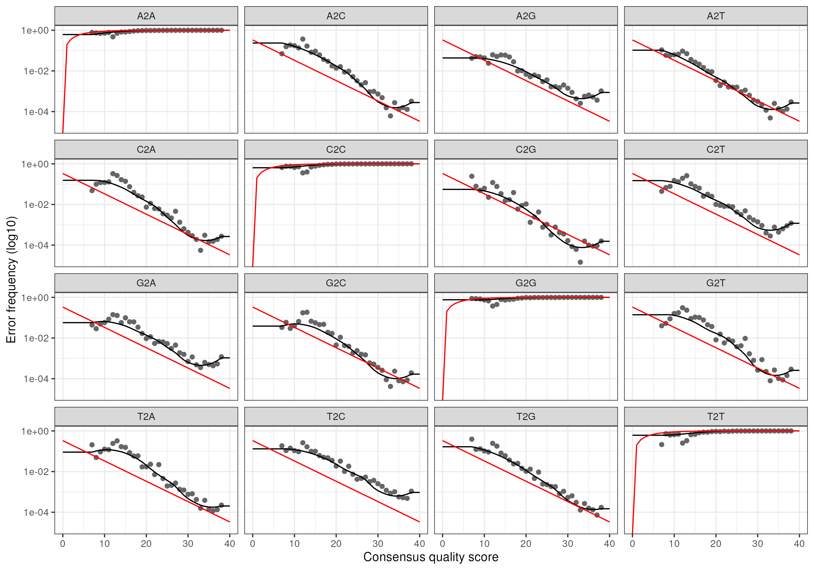

# Analyse critique d'article scientifique 
### Travail réalisé par Appy--Ruat Enguerrand et Bernard Antoine, au travers de l'UE ADM encadrée par Mr. Maignien L. lors de la première année du Master MFA de l'Université Occidentale de Bretagne, Brest.

#### Etude sur laquelle est basée cette analyse : Coton M, Deniel F, Mounier J, Joubrel R, Robieu E, Pawtowski A, Jeuge S, Taminiau B, Daube G, Coton E, Frémaux B. Microbial Ecology of French Dry Fermented Sausages and Mycotoxin Risk Evaluation During Storage. Front Microbiol. 2021 Nov 4;12:737140. doi: 10.3389/fmicb.2021.737140. PMID: 34803951; PMCID: PMC8601720.

Le saucisson sec français est un écosystème complexe où interagissent des bactéries lactiques, des staphylocoques à coagulase négative, des levures et des moisissures. Si cette microflore est essentielle au développement des qualités organoleptiques (goût, texture, odeur), elle joue aussi un rôle crucial de barrière protectrice.

Le problème central de l'article est l'évaluation de l'équilibre de l'écosystème microbien face au risque de contamination fongique toxique.

Plus précisément, l'étude cherche à comprendre :
- Identification des communautées fongiques et bactéries.
- Comparaison des profils microbiens avec/sans inoculation.

L'utilisation de DADA2 permettra de passer des séquences brutes (FastQ) à des ASV (Amplicon Sequence Variants), offrant une résolution taxonomique plus fine que les anciens OTU pour distinguer des espèces proches de Penicillium ou de Staphylococcus.

Une fois les séquences traitées par l’algorithme DADA2 et les tables d’ASV (Amplicon Sequence Variants) générées, l’intégration des données sous l’environnement Phyloseq constitue l'étape charnière de l’analyse. Cet outil permet de croiser les données taxonomiques avec les métadonnées de l'étude (type de saucisson, durée de stockage, présence de mycotoxines) pour répondre à trois objectifs fondamentaux :

### 1. Caractérisation de la Diversité Alpha

L’analyse de la diversité alpha permet de mesurer la richesse et l’équitabilité des espèces au sein de chaque échantillon. Dans le contexte du saucisson sec, il s’agit de déterminer si les processus de fermentation ou les conditions de stockage influencent le nombre d’espèces présentes. En utilisant des indices tels que Shannon ou Simpson, nous pouvons vérifier si une perte de diversité microbienne est corrélée à une vulnérabilité accrue face à la colonisation par des moisissures indésirables.

### 2. Comparaison de la Diversité Bêta

La diversité bêta est essentielle pour comparer la structure des communautés entre différents groupes d'échantillons. Par le biais de méthodes d'ordination comme le PCoA (Principal Coordinates Analysis) ou le NMDS basés sur les distances de Bray-Curtis ou Unifrac, Phyloseq permet de visualiser si les échantillons se regroupent en fonction de leur profil de sécurité sanitaire. Cette étape permet de distinguer clairement la signature microbienne des saucissons "sains" de ceux présentant un risque de contamination par les mycotoxines, mettant ainsi en évidence l'impact des variations de la flore sur la stabilité du produit.


## Mise en place de dada2

```{r, echo=FALSE}
library(dada2)
```
```{r, echo=FALSE}
csv <- read.csv2("~/dossier_1/analyse_article_ADM/data2/SraRunTable.csv", header = TRUE, sep = ",")
```

```{r}
path<- "~/dossier_1/analyse_article_ADM/data2/donnees"
list.files(path)
```
```{r}
 [1] "SRR15634651_1.fastq" "SRR15634651_2.fastq" "SRR15634652_1.fastq" "SRR15634652_2.fastq"
  [5] "SRR15634653_1.fastq" "SRR15634653_2.fastq" "SRR15634654_1.fastq" "SRR15634654_2.fastq"
  [9] "SRR15634655_1.fastq" "SRR15634655_2.fastq" "SRR15634656_1.fastq" "SRR15634656_2.fastq"
 [13] "SRR15634657_1.fastq" "SRR15634657_2.fastq" "SRR15634658_1.fastq" "SRR15634658_2.fastq"
 [17] "SRR15634659_1.fastq" "SRR15634659_2.fastq" "SRR15634660_1.fastq" "SRR15634660_2.fastq"
 [21] "SRR15634661_1.fastq" "SRR15634661_2.fastq" "SRR15634662_1.fastq" "SRR15634662_2.fastq"
 [25] "SRR15634663_1.fastq" "SRR15634663_2.fastq" "SRR15634664_1.fastq" "SRR15634664_2.fastq"
 [29] "SRR15634665_1.fastq" "SRR15634665_2.fastq" "SRR15634666_1.fastq" "SRR15634666_2.fastq"
 [33] "SRR15634667_1.fastq" "SRR15634667_2.fastq" "SRR15634668_1.fastq" "SRR15634668_2.fastq"
 [37] "SRR15634669_1.fastq" "SRR15634669_2.fastq" "SRR15634670_1.fastq" "SRR15634670_2.fastq"
 [41] "SRR15634671_1.fastq" "SRR15634671_2.fastq" "SRR15634672_1.fastq" "SRR15634672_2.fastq"
 [45] "SRR15634673_1.fastq" "SRR15634673_2.fastq" "SRR15634674_1.fastq" "SRR15634674_2.fastq"
 [49] "SRR15634675_1.fastq" "SRR15634675_2.fastq" "SRR15634676_1.fastq" "SRR15634676_2.fastq"
 [53] "SRR15634677_1.fastq" "SRR15634677_2.fastq" "SRR15634678_1.fastq" "SRR15634678_2.fastq"
 [57] "SRR15634679_1.fastq" "SRR15634679_2.fastq" "SRR15634680_1.fastq" "SRR15634680_2.fastq"
 [61] "SRR15634681_1.fastq" "SRR15634681_2.fastq" "SRR15634682_1.fastq" "SRR15634682_2.fastq"
 [65] "SRR15634683_1.fastq" "SRR15634683_2.fastq" "SRR15634684_1.fastq" "SRR15634684_2.fastq"
 [69] "SRR15634685_1.fastq" "SRR15634685_2.fastq" "SRR15634686_1.fastq" "SRR15634686_2.fastq"
 [73] "SRR15634687_1.fastq" "SRR15634687_2.fastq" "SRR15634688_1.fastq" "SRR15634688_2.fastq"
 [77] "SRR15634689_1.fastq" "SRR15634689_2.fastq" "SRR15634690_1.fastq" "SRR15634690_2.fastq"
 [81] "SRR15635525_1.fastq" "SRR15635525_2.fastq" "SRR15635526_1.fastq" "SRR15635526_2.fastq"
 [85] "SRR15635527_1.fastq" "SRR15635527_2.fastq" "SRR15635528_1.fastq" "SRR15635528_2.fastq"
 [89] "SRR15635529_1.fastq" "SRR15635529_2.fastq" "SRR15635530_1.fastq" "SRR15635530_2.fastq"
 [93] "SRR15635531_1.fastq" "SRR15635531_2.fastq" "SRR15635532_1.fastq" "SRR15635532_2.fastq"
 [97] "SRR15635533_1.fastq" "SRR15635533_2.fastq" "SRR15635534_1.fastq" "SRR15635534_2.fastq"
[101] "SRR15635535_1.fastq" "SRR15635535_2.fastq" "SRR15635536_1.fastq" "SRR15635536_2.fastq"
[105] "SRR15635537_1.fastq" "SRR15635537_2.fastq" "SRR15635538_1.fastq" "SRR15635538_2.fastq"
[109] "SRR15635539_1.fastq" "SRR15635539_2.fastq" "SRR15635540_1.fastq" "SRR15635540_2.fastq"
[113] "SRR15635541_1.fastq" "SRR15635541_2.fastq" "SRR15635542_1.fastq" "SRR15635542_2.fastq"
[117] "SRR15635543_1.fastq" "SRR15635543_2.fastq" "SRR15635544_1.fastq" "SRR15635544_2.fastq"
[121] "SRR15635545_1.fastq" "SRR15635545_2.fastq" "SRR15635546_1.fastq" "SRR15635546_2.fastq"
[125] "SRR15635547_1.fastq" "SRR15635547_2.fastq" "SRR15635548_1.fastq" "SRR15635548_2.fastq"
[129] "SRR15635549_1.fastq" "SRR15635549_2.fastq" "SRR15635550_1.fastq" "SRR15635550_2.fastq"
[133] "SRR15635551_1.fastq" "SRR15635551_2.fastq" "SRR15635552_1.fastq" "SRR15635552_2.fastq"
[137] "SRR15635553_1.fastq" "SRR15635553_2.fastq" "SRR15635554_1.fastq" "SRR15635554_2.fastq"
[141] "SRR15635555_1.fastq" "SRR15635555_2.fastq" "SRR15635556_1.fastq" "SRR15635556_2.fastq"
[145] "SRR15635557_1.fastq" "SRR15635557_2.fastq" "SRR15635558_1.fastq" "SRR15635558_2.fastq"
[149] "SRR15635559_1.fastq" "SRR15635559_2.fastq" "SRR15635560_1.fastq" "SRR15635560_2.fastq"
[153] "SRR15635561_1.fastq" "SRR15635561_2.fastq" "SRR15635562_1.fastq" "SRR15635562_2.fastq"
[157] "SRR15635563_1.fastq" "SRR15635563_2.fastq" "SRR15635564_1.fastq" "SRR15635564_2.fastq"
```

```{r}
system("gunzip ~/dossier_1/analyse_article_ADM/data2/donnees/*.gz")
```

```{r}
# Forward and reverse fastq filenames have format: SAMPLENAME_R1_001.fastq and SAMPLENAME_R2_001.fastq
fnFs <- sort(list.files(path, pattern="_1.fastq", full.names = TRUE))
fnRs <- sort(list.files(path, pattern="_2.fastq", full.names = TRUE))
# Extract sample names, assuming filenames have format: SAMPLENAME_XXX.fastq
sample.names <- sapply(strsplit(basename(fnFs), "_"), `[`, 1)
```

```{r}
plotQualityProfile(fnFs[1:2])
```
<!-- -->

```{r}
plotQualityProfile(fnRs[1:2])
```
<!-- -->

```{r}
filtFs <- file.path(path, "filtered", # Crée un chemin vers un sous-dosier "filtered" à l'intérieur du dossier 'path"
                    paste0(sample.names, "_F_filt.fastq.gz"))# Crée le nom du fichier filtré pour chaque échantillon

filtRs <- file.path(path, "filtered", paste0(sample.names, "_R_filt.fastq.gz"))
names(filtFs) <- sample.names
names(filtRs) <- sample.names # Attribution de ces noms aux fichiers
```

```{r}
out <- filterAndTrim(fnFs, filtFs, fnRs, filtRs, truncLen=c(290,270), # Tronque les lectures Forward à 240 bases et Reverse à 160 bases
              maxN=0, # Elimine toutes lecture contenant une base inconnue
              maxEE=c(2,2), # Maximum d'erreurs par lecture
              truncQ=2, # Tronque la lecture dès que son score de qualité est inférieur à 2
              rm.phix=TRUE, # Supprime les lectures provenant du génome PhiX
              compress=TRUE, multithread=FALSE) 
head(out)
```

```{r}
                    reads.in reads.out
SRR15634651_1.fastq    62839     37465
SRR15634652_1.fastq    44399     24703
SRR15634653_1.fastq    44376     19114
SRR15634654_1.fastq   111565     29045
SRR15634655_1.fastq    70934     45311
SRR15634656_1.fastq    87940     44730
```

```{r}
errF <- learnErrors(filtFs, multithread=FALSE)# Modèle statistique des erreurs à partir des lectures filtrées Forward
```

```{r}
100568230 total bases in 346787 reads from 13 samples will be used for learning the error rates.
```

```{r}
errR <- learnErrors(filtRs, multithread=FALSE)# Modèle statistique des erreurs à partir des lectures filtrées Reverse
```

```{r}
103531500 total bases in 383450 reads from 14 samples will be used for learning the error rates.
```

```{r}
plotErrors(errF, nominalQ=TRUE)
```
<!-- -->

```{r}
dadaFs <- dada(filtFs, err=errF, multithread=FALSE)
```

```{r}
Sample 1 - 37465 reads in 13617 unique sequences.
Sample 2 - 24703 reads in 8781 unique sequences.
Sample 3 - 19114 reads in 7827 unique sequences.
Sample 4 - 29045 reads in 11438 unique sequences.
Sample 5 - 45311 reads in 13252 unique sequences.
Sample 6 - 44730 reads in 15516 unique sequences.
Sample 7 - 29314 reads in 6721 unique sequences.
Sample 8 - 33035 reads in 7984 unique sequences.
Sample 9 - 31676 reads in 9601 unique sequences.
Sample 10 - 20971 reads in 6867 unique sequences.
Sample 11 - 1860 reads in 802 unique sequences.
Sample 12 - 1995 reads in 1251 unique sequences.
Sample 13 - 27568 reads in 7970 unique sequences.
Sample 14 - 36663 reads in 7801 unique sequences.
Sample 15 - 40680 reads in 7403 unique sequences.
Sample 16 - 27641 reads in 7006 unique sequences.
Sample 17 - 48064 reads in 15785 unique sequences.
Sample 18 - 27223 reads in 5915 unique sequences.
Sample 19 - 27876 reads in 6870 unique sequences.
Sample 20 - 62278 reads in 13767 unique sequences.
Sample 21 - 33007 reads in 7939 unique sequences.
Sample 22 - 21025 reads in 4169 unique sequences.
Sample 23 - 16315 reads in 5307 unique sequences.
Sample 24 - 56545 reads in 13278 unique sequences.
Sample 25 - 46051 reads in 11585 unique sequences.
Sample 26 - 42421 reads in 9148 unique sequences.
Sample 27 - 36467 reads in 10663 unique sequences.
Sample 28 - 22847 reads in 9765 unique sequences.
Sample 29 - 43864 reads in 14299 unique sequences.
Sample 30 - 49171 reads in 16341 unique sequences.
Sample 31 - 20177 reads in 8957 unique sequences.
Sample 32 - 32538 reads in 13199 unique sequences.
Sample 33 - 50656 reads in 11396 unique sequences.
Sample 34 - 19198 reads in 8368 unique sequences.
Sample 35 - 49141 reads in 16647 unique sequences.
Sample 36 - 35665 reads in 13518 unique sequences.
Sample 37 - 19577 reads in 6460 unique sequences.
Sample 38 - 15892 reads in 6878 unique sequences.
Sample 39 - 6034 reads in 2168 unique sequences.
Sample 40 - 19455 reads in 8719 unique sequences.
Sample 41 - 79546 reads in 76631 unique sequences.
Sample 42 - 79589 reads in 78313 unique sequences.
Sample 43 - 62947 reads in 61429 unique sequences.
Sample 44 - 90021 reads in 87445 unique sequences.
Sample 45 - 96931 reads in 95006 unique sequences.
Sample 46 - 68413 reads in 66079 unique sequences.
Sample 47 - 29443 reads in 28017 unique sequences.
Sample 48 - 40609 reads in 40018 unique sequences.
Sample 49 - 47485 reads in 47091 unique sequences.
Sample 50 - 22145 reads in 21988 unique sequences.
Sample 51 - 31743 reads in 31443 unique sequences.
Sample 52 - 17241 reads in 17189 unique sequences.
Sample 53 - 19794 reads in 19631 unique sequences.
Sample 54 - 31099 reads in 28214 unique sequences.
Sample 55 - 69875 reads in 65209 unique sequences.
Sample 56 - 66258 reads in 60513 unique sequences.
Sample 57 - 69240 reads in 67897 unique sequences.
Sample 58 - 37248 reads in 36747 unique sequences.
Sample 59 - 14377 reads in 14192 unique sequences.
Sample 60 - 31308 reads in 30853 unique sequences.
Sample 61 - 21976 reads in 21886 unique sequences.
Sample 62 - 27018 reads in 26731 unique sequences.
Sample 63 - 29963 reads in 29586 unique sequences.
Sample 64 - 37394 reads in 36231 unique sequences.
Sample 65 - 36582 reads in 35141 unique sequences.
Sample 66 - 50764 reads in 48749 unique sequences.
Sample 67 - 21543 reads in 20547 unique sequences.
Sample 68 - 88380 reads in 83993 unique sequences.
Sample 69 - 71625 reads in 69020 unique sequences.
Sample 70 - 77971 reads in 75947 unique sequences.
Sample 71 - 103805 reads in 99699 unique sequences.
Sample 72 - 64800 reads in 62372 unique sequences.
Sample 73 - 68097 reads in 67151 unique sequences.
Sample 74 - 91350 reads in 87466 unique sequences.
Sample 75 - 77780 reads in 76001 unique sequences.
Sample 76 - 84785 reads in 81273 unique sequences.
Sample 77 - 71043 reads in 68857 unique sequences.
Sample 78 - 81405 reads in 77977 unique sequences.
Sample 79 - 95562 reads in 90474 unique sequences.
Sample 80 - 102112 reads in 97411 unique sequences.
```

```{r}
dadaRs <- dada(filtRs, err=errR, multithread=FALSE)
```

```{r}
Sample 1 - 37465 reads in 10403 unique sequences.
Sample 2 - 24703 reads in 6083 unique sequences.
Sample 3 - 19114 reads in 6412 unique sequences.
Sample 4 - 29045 reads in 8342 unique sequences.
Sample 5 - 45311 reads in 9299 unique sequences.
Sample 6 - 44730 reads in 13305 unique sequences.
Sample 7 - 29314 reads in 6308 unique sequences.
Sample 8 - 33035 reads in 8568 unique sequences.
Sample 9 - 31676 reads in 9413 unique sequences.
Sample 10 - 20971 reads in 6474 unique sequences.
Sample 11 - 1860 reads in 717 unique sequences.
Sample 12 - 1995 reads in 980 unique sequences.
Sample 13 - 27568 reads in 7221 unique sequences.
Sample 14 - 36663 reads in 7451 unique sequences.
Sample 15 - 40680 reads in 7053 unique sequences.
Sample 16 - 27641 reads in 6659 unique sequences.
Sample 17 - 48064 reads in 14669 unique sequences.
Sample 18 - 27223 reads in 5418 unique sequences.
Sample 19 - 27876 reads in 6413 unique sequences.
Sample 20 - 62278 reads in 12629 unique sequences.
Sample 21 - 33007 reads in 8755 unique sequences.
Sample 22 - 21025 reads in 4373 unique sequences.
Sample 23 - 16315 reads in 4592 unique sequences.
Sample 24 - 56545 reads in 11837 unique sequences.
Sample 25 - 46051 reads in 10785 unique sequences.
Sample 26 - 42421 reads in 7741 unique sequences.
Sample 27 - 36467 reads in 9880 unique sequences.
Sample 28 - 22847 reads in 7905 unique sequences.
Sample 29 - 43864 reads in 12097 unique sequences.
Sample 30 - 49171 reads in 11361 unique sequences.
Sample 31 - 20177 reads in 7048 unique sequences.
Sample 32 - 32538 reads in 10662 unique sequences.
Sample 33 - 50656 reads in 9248 unique sequences.
Sample 34 - 19198 reads in 6468 unique sequences.
Sample 35 - 49141 reads in 14623 unique sequences.
Sample 36 - 35665 reads in 12101 unique sequences.
Sample 37 - 19577 reads in 3842 unique sequences.
Sample 38 - 15892 reads in 5116 unique sequences.
Sample 39 - 6034 reads in 1772 unique sequences.
Sample 40 - 19455 reads in 7095 unique sequences.
Sample 41 - 79546 reads in 23741 unique sequences.
Sample 42 - 79589 reads in 36955 unique sequences.
Sample 43 - 62947 reads in 21055 unique sequences.
Sample 44 - 90021 reads in 36998 unique sequences.
Sample 45 - 96931 reads in 37426 unique sequences.
Sample 46 - 68413 reads in 25102 unique sequences.
Sample 47 - 29443 reads in 10680 unique sequences.
Sample 48 - 40609 reads in 16919 unique sequences.
Sample 49 - 47485 reads in 19897 unique sequences.
Sample 50 - 22145 reads in 9688 unique sequences.
Sample 51 - 31743 reads in 13614 unique sequences.
Sample 52 - 17241 reads in 9766 unique sequences.
Sample 53 - 19794 reads in 7606 unique sequences.
Sample 54 - 31099 reads in 8647 unique sequences.
Sample 55 - 69875 reads in 24928 unique sequences.
Sample 56 - 66258 reads in 24462 unique sequences.
Sample 57 - 69240 reads in 24403 unique sequences.
Sample 58 - 37248 reads in 14136 unique sequences.
Sample 59 - 14377 reads in 6464 unique sequences.
Sample 60 - 31308 reads in 11437 unique sequences.
Sample 61 - 21976 reads in 11598 unique sequences.
Sample 62 - 27018 reads in 12875 unique sequences.
Sample 63 - 29963 reads in 12159 unique sequences.
Sample 64 - 37394 reads in 15031 unique sequences.
Sample 65 - 36582 reads in 13695 unique sequences.
Sample 66 - 50764 reads in 17683 unique sequences.
Sample 67 - 21543 reads in 7480 unique sequences.
Sample 68 - 88380 reads in 23074 unique sequences.
Sample 69 - 71625 reads in 18097 unique sequences.
Sample 70 - 77971 reads in 31371 unique sequences.
Sample 71 - 103805 reads in 28537 unique sequences.
Sample 72 - 64800 reads in 24599 unique sequences.
Sample 73 - 68097 reads in 30190 unique sequences.
Sample 74 - 91350 reads in 31461 unique sequences.
Sample 75 - 77780 reads in 25785 unique sequences.
Sample 76 - 84785 reads in 25987 unique sequences.
Sample 77 - 71043 reads in 24850 unique sequences.
Sample 78 - 81405 reads in 21530 unique sequences.
Sample 79 - 95562 reads in 23913 unique sequences.
Sample 80 - 102112 reads in 28919 unique sequences.
```

```{r}
dadaFs[[1]]
```

```{r}
dada-class: object describing DADA2 denoising results
75 sequence variants were inferred from 13617 input unique sequences.
Key parameters: OMEGA_A = 1e-40, OMEGA_C = 1e-40, BAND_SIZE = 16
```

```{r}
mergers <- mergePairs(dadaFs, filtFs, dadaRs, filtRs, verbose=TRUE)
# Inspect the merger data.frame from the first sample
head(mergers[[1]])
```

```{r}  
1	
2	
3	
4	
5	
6	
6 rows | 1-1 of 9 columns
```

```{r}
seqtab <- makeSequenceTable(mergers)
dim(seqtab)
```

```{r}
[1]   80 4559
```

```{r}
# Inspect distribution of sequence lengths
table(nchar(getSequences(seqtab)))
```

```{r}
 290  293  299  301  305  306  309  310  322  323  328  329  331  332  333  337  338  339  341 
  11    1    1    1    1    8    2    6   10    1    1    1    7    7    1   14   13    2   16 
 342  343  344  345  346  347  348  349  350  351  352  353  355  359  361  363  365  367  368 
   3   71    3   51   12   13    1    4   15   19    7    9    1    1    1    9    3    1    1 
 369  370  371  372  373  374  375  376  382  387  388  391  394  395  396  398  400  402  405 
  69   31   11   20    2    2   32  140    6    1    2    1    5    1    5    4    1    8    9 
 406  409  414  415  416  418  421  424  425  426  427  430  440  457  458  476  478  485  496 
   3    4    1    8    8    1   16   19  122    1    8    2    4    3    5   15    2    3    6 
 501  510  512  514  516  519  520  521  523  524  525  528  529  530  531  532  537  539  540 
  36   14    1    9    3   31   20    1    1   21    8    2   12   46    2   24    1 2688  551 
 541  542  543  546  548 
 131   12    3   26    6
```

```{r}
seqtab.nochim <- removeBimeraDenovo(seqtab, method="consensus", multithread=FALSE, verbose=TRUE)
dim(seqtab.nochim)
```

```{r}
Identified 3400 bimeras out of 4559 input sequences.
[1]   80 1159
```

```{r}
sum(seqtab.nochim)/sum(seqtab)
```

```{r}
[1] 0.8507601
```

```{r}
getN <- function(x) sum(getUniques(x))
track <- cbind(out, sapply(dadaFs, getN), sapply(dadaRs, getN), sapply(mergers, getN), rowSums(seqtab.nochim))
colnames(track) <- c("input", "filtered", "denoisedF", "denoisedR", "merged", "nonchim")
rownames(track) <- sample.names
head(track)
```

```{r}
             input filtered denoisedF denoisedR merged nonchim
SRR15634651  62839    37465     37325     37346  36642   32366
SRR15634652  44399    24703     24661     24695  24532   22748
SRR15634653  44376    19114     19004     19030  17932   16601
SRR15634654 111565    29045     28915     28990  28401   25686
SRR15634655  70934    45311     45209     45278  45106   44802
SRR15634656  87940    44730     44579     44618  43046   40178
```

## Partie fongique 

### Assignation taxonomique 

```{r}
library(DECIPHER)

load("UNITE_v2023_July_2023.RData") 

dna <- DNAStringSet(seqs)

ids <- IdTaxa(dna, trainingSet, strand="both", processors=1)

ranks <- c("domain", "phylum", "class", "order", "family", "genus", "species")
taxa_unite <- t(sapply(ids, function(x) {
  m <- match(ranks, x$rank)
  tax <- x$taxon[m]
  tax[is.na(tax)] <- NA
  tax
}))
colnames(taxa_unite) <- c("Kingdom", "Phylum", "Class", "Order", "Family", "Genus", "Species")
rownames(taxa_unite) <- seqs
```

```{r}
|======================================================================================| 100%

Time difference of 2349.7 secs
```

```{r}
rownames(taxa_unite) <- NULL
head(taxa_unite)
```

```{r}
 Kingdom Phylum       Class             Order               Family             
[1,] NA      "Ascomycota" "Saccharomycetes" "Saccharomycetales" "Debaryomycetaceae"
[2,] NA      "Ascomycota" "Saccharomycetes" "Saccharomycetales" "Debaryomycetaceae"
[3,] NA      "Ascomycota" "Saccharomycetes" "Saccharomycetales" "Debaryomycetaceae"
[4,] NA      "Ascomycota" "Saccharomycetes" "Saccharomycetales" "Debaryomycetaceae"
[5,] NA      "Ascomycota" "Saccharomycetes" "Saccharomycetales" "Debaryomycetaceae"
[6,] NA      "Ascomycota" "Saccharomycetes" "Saccharomycetales" "Debaryomycetaceae"
     Genus          Species                  
[1,] "Debaryomyces" "Debaryomyces_prosopidis"
[2,] "Debaryomyces" "Debaryomyces_prosopidis"
[3,] "Debaryomyces" "Debaryomyces_prosopidis"
[4,] "Debaryomyces" "Debaryomyces_prosopidis"
[5,] "Debaryomyces" "Debaryomyces_prosopidis"
[6,] "Debaryomyces" "Debaryomyces_prosopidis"
```

### Création de l'objet phyloseq 

```{r}
library(phyloseq)

ps <- phyloseq(otu_table(seqtab.nochim, taxa_are_rows=FALSE), 
               tax_table(as.matrix(taxa_unite)))

tax_table(ps)[is.na(tax_table(ps))] <- "Unassigned"
```

### Création des ASV 

```{r}
dna <- Biostrings::DNAStringSet(taxa_names(ps))
names(dna) <- taxa_names(ps)
ps <- merge_phyloseq(ps, dna)

taxa_names(ps) <- paste0("ASV", seq(ntaxa(ps)))
```

### Création des groupes d'échantillonnage 

```{r}
samdf <- data.frame(SampleID = sample_names(ps), row.names = sample_names(ps))

samdf$SampleGroup <- ifelse(seq_len(nrow(samdf)) <= 40, "Direct", "No Inoculation")

sample_data(ps) <- sample_data(samdf)

print(table(sample_data(ps)$SampleGroup))
```

```{r}
 Direct No Inoculation 
            40             40 
```

```{r}
p <- plot_richness(ps, 
                   x = "SampleGroup", 
                   measures = c("Shannon", "Simpson"), 
                   color = "SampleGroup") +
  
  geom_boxplot(alpha = 0.4, outlier.shape = NA) +
  
  geom_jitter(width = 0.1, alpha = 0.5) +

  theme_bw() +
  scale_color_manual(values = c("Direct" = "royalblue", "No Inoculation" = "firebrick")) +
  labs(title = "Diversité Alpha : Comparaison des Fermentations",
       subtitle = "Indices de Shannon et Simpson (n=79)",
       x = "Groupe expérimental",
       y = "Valeur de l'indice") +
  theme(legend.position = "none",
        strip.background = element_rect(fill = "white"),
        strip.text = element_text(face = "bold", size = 12))


print(p)
```

